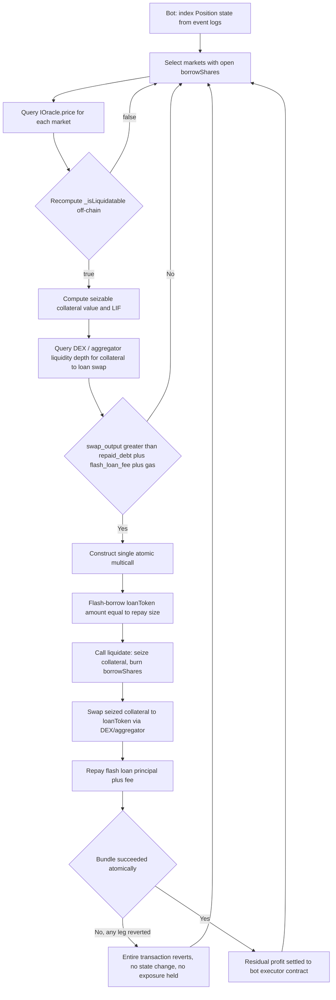

# Isolated Lending Protocol — Developer Specification

`Spec Version: 1.0.0` · `Status: Draft — Pre-Audit` · `Target EVM: Cancun` · `Solidity: ^0.8.20`

---

## 1. Architectural Overview

### 1.1 The Isolated Market Paradigm

An isolated market is a 5-tuple: `(loanToken, collateralToken, oracle, irm, lltv)`. Each unique tuple hash (`keccak256(abi.encode(MarketParams))`) resolves to an entirely independent accounting namespace — its own `totalSupplyAssets`, `totalBorrowAssets`, and share ledger. No liquidity, collateral, or bad debt crosses the boundary between market IDs. This is the structural inverse of a pooled design like Aave v3's shared reserve model, where dozens of collateral types back a common liquidity pool and a single mispriced or illiquid asset can impair solvency for lenders who never chose exposure to it.

Contagion in a pooled system is not a tail-risk edge case — it is a direct consequence of shared reserves. If collateral asset X depegs and the protocol accrues bad debt against the shared USDC pool, every USDC lender absorbs a pro-rata haircut, regardless of whether they ever intended exposure to X. Isolation removes this by construction: a lender who supplies to the `wstETH/USDC @ 86% LLTV` market has counterparty exposure to exactly that collateral, that oracle, and that risk parameter set — nothing else. Bad debt in the `PEPE/USDC @ 60% LLTV` market is mathematically incapable of touching it. Risk is priced and underwritten per-market by the lender's choice of vault allocation, not socialized by protocol governance after the fact.

The tradeoff is fragmented liquidity and the reintroduction of curation as an explicit, off-chain responsibility — addressed in §1.2.

### 1.2 Immutable Core vs. External Risk Modules

The protocol separates two concerns that pooled designs conflate:

| Layer | Mutability | Responsibility |
|---|---|---|
| **Core contract** | Immutable, no admin keys, no upgradeability proxy | Accounting primitives: supply, borrow, repay, withdraw, liquidate. Enforces solvency via `lltv` at the point of borrow and liquidation only. |
| **IRM (Interest Rate Model)** | Pluggable per market, whitelisted by governance at deployment, immutable once a market is created against it | Pure function `borrowRate(marketId, utilization) -> rate`. No state mutation beyond its own internal curve state. |
| **Oracle** | Pluggable per market, chosen at market creation, immutable once set | Returns `collateralToken` price denominated in `loanToken`, scaled to `1e36`. |
| **Curation (Vaults / Meta-morpho layer)** | Fully off-core, governed by third-party curators | Allocates lender deposits across a whitelist of isolated markets, sets per-market supply caps, performs risk due diligence. |

Because the core contract has **zero privileged functions** over an existing market's parameters — `lltv`, `oracle`, and `irm` are immutable the instant a market is created — the trust surface for a lender collapses to three static addresses they can audit once, not a continuously mutable governance process. Risk curation (which markets are "safe," what supply caps apply, what the resulting blended yield/risk profile looks like) is explicitly pushed to a separate, non-privileged vault layer built *on top of* the immutable core, so the base protocol's security assumptions never depend on the correctness of any single risk manager's judgment.

---

## 2. Quantitative Risk Metrics & Mathematical Formulation

### 2.1 LLTV — Liquidation Loan-To-Value

> **Terminology note:** LLTV denotes **Liquidation Loan-To-Value**, the canonical static risk parameter in isolated-market design — not a time-variance metric. It is a constant, WAD-scaled ratio (`1e18` = 100%) fixed permanently at market creation. There is no drift, no re-parameterization, no keeper-adjustable curve; the immutability of `lltv` is precisely what allows lenders to underwrite the market's tail risk with certainty at the point of deposit.

`lltv` defines the **absolute upper bound of leverage** obtainable in the market:

$$
\text{Leverage}_{\max} = \frac{1}{1 - \text{LLTV}}
$$

For `LLTV = 0.86e18` (86%), `Leverage_max = 1 / (1 - 0.86) = 7.14x`. This is a hard ceiling enforced at the smart-contract level on every `borrow()` call — the transaction reverts if it would push the position's LTV above `lltv`, full stop. The parameter is chosen at market deployment as a function of the collateral asset's historical volatility (σ), the oracle's update latency, and the venue's realistic liquidation-execution slippage; it is *not* adjustable post-deployment, which is what makes the market's maximum risk exposure a knowable constant rather than a governance variable.

### 2.2 Market Health Factor

For a given position in market $m$:

$$
H_m = \frac{C_v \cdot \text{LLTV}_m}{B_v}
$$

Where:
- $C_v$ = Collateral Value, denominated in the loan asset (`collateral_amount × oracle.price() / 1e36`)
- $B_v$ = Borrowed Value, denominated in the loan asset (`borrowShares × totalBorrowAssets / totalBorrowShares`)
- $\text{LLTV}_m$ = the immutable liquidation threshold for market $m$, WAD-scaled

**Solvency condition:** the position is healthy iff $H_m \geq 1$. Liquidation eligibility is the strict complement:

$$
\text{isLiquidatable} \iff H_m < 1 \iff B_v > C_v \cdot \text{LLTV}_m
$$

Note this is algebraically identical to comparing raw asset values rather than a normalized ratio — the on-chain implementation in §3 checks the un-normalized inequality directly (`borrowedAssets > maxBorrowable`) to avoid an unnecessary division and its associated rounding-direction risk.

### 2.3 Liquidation Incentive Factor (Liquidation Discount)

Liquidators are compensated by seizing collateral at a discount to its oracle-marked value. Define the **Liquidation Incentive Factor** $\text{LIF}$ as the multiplier applied to the debt repaid, determining how much collateral (in value terms) the liquidator receives per unit of debt cleared:

$$
\text{LIF} = \min\left(\text{LIF}_{\max},\ \frac{1}{1 - (1 - \text{LLTV}_m)\cdot \beta}\right)
$$

Where $\beta \in (0, 1]$ is a protocol-set **liquidation cursor** interpolating between zero discount and the maximum discount implied by the market's own risk band, and $\text{LIF}_{\max}$ is a hard cap (commonly `1.10`–`1.15`, i.e. 10–15%) bounding liquidator extraction so a single liquidation event cannot itself become a value-destructive shock to the borrower. Tighter markets (high LLTV, low-volatility collateral like stETH/ETH) mechanically produce a smaller discount than wide-band markets (low LLTV, volatile long-tail collateral), because $(1 - \text{LLTV}_m)$ scales the available margin directly.

**The bad-debt boundary.** For a repayment of debt value $R$, the liquidator receives collateral worth $R \cdot \text{LIF}$. This is solvent for the protocol only while the position's remaining collateral value can cover it. Bad debt begins accruing precisely when the collateral is insufficient to pay out the incentivized seizure, i.e. when:

$$
C_v < B_v \cdot \text{LIF}
$$

This is the critical inequality: at $H_m < 1$ the position is *liquidatable*, but a **second, more severe threshold** exists at $C_v < B_v \cdot \text{LIF}$ — beyond this point, full liquidation would require seizing more collateral value than exists, and the shortfall becomes unrecoverable bad debt socialized across that market's *own* supply-side lenders (never cross-market, per §1.1). This is why $\text{LIF}_{\max}$ and $\text{LLTV}$ are co-designed: the gap $(1 - \text{LLTV}_m)$ must remain wide enough, relative to expected oracle staleness and realistic liquidation latency, that this second threshold is rarely crossed even during volatility spikes.

---

## 3. Smart Contract Implementation Spec (Solidity)

```solidity
// SPDX-License-Identifier: BUSL-1.1
pragma solidity ^0.8.20;

/*//////////////////////////////////////////////////////////////
                            CONSTANTS
//////////////////////////////////////////////////////////////*/

uint256 constant WAD = 1e18;
uint256 constant ORACLE_PRICE_SCALE = 1e36;

/*//////////////////////////////////////////////////////////////
                        CORE DATA STRUCTURES
//////////////////////////////////////////////////////////////*/

struct MarketParams {
    address loanToken;       // ERC-20 borrowed by the debtor
    address collateralToken; // ERC-20 posted as collateral
    address oracle;          // collateral -> loan price feed, scaled 1e36
    address irm;              // Interest Rate Model: pure fn of utilization
    uint256 lltv;             // Liquidation LTV, WAD-scaled (0.86e18 = 86%)
}

struct Position {
    uint128 supplyShares;    // Lender claim on the supply-side liquidity
    uint128 borrowShares;    // Debtor's proportional claim on total debt
    uint128 collateral;      // Raw collateralToken balance (NOT shares)
}

struct Market {
    uint128 totalSupplyAssets;
    uint128 totalSupplyShares;
    uint128 totalBorrowAssets;
    uint128 totalBorrowShares;
    uint128 lastUpdate;
    uint128 fee;              // protocol fee, WAD-scaled
}

interface IOracle {
    /// @notice Price of 1 unit of collateralToken denominated in loanToken,
    ///         scaled by 1e36 to absorb decimal mismatches between the two
    ///         ERC-20s without ever branching on token.decimals() on-chain.
    function price() external view returns (uint256);
}

/*//////////////////////////////////////////////////////////////
                        FIXED-POINT HELPERS
//////////////////////////////////////////////////////////////*/

library MathLib {
    /// @dev Rounds toward zero.
    function mulDivDown(uint256 x, uint256 y, uint256 d) internal pure returns (uint256) {
        return (x * y) / d;
    }

    /// @dev Rounds away from zero — used wherever rounding in the
    ///      protocol's favor is required for conservative solvency checks.
    function mulDivUp(uint256 x, uint256 y, uint256 d) internal pure returns (uint256) {
        return (x * y + (d - 1)) / d;
    }
}

/*//////////////////////////////////////////////////////////////
                LIQUIDATION ELIGIBILITY — CORE CHECK
//////////////////////////////////////////////////////////////*/

contract IsolatedMarketCore {
    using MathLib for uint256;

    mapping(bytes32 => Market) public market;
    mapping(bytes32 => mapping(address => Position)) public position;

    /// @dev Pure solvency check corresponding to H_m < 1 from §2.2.
    ///      Debt is rounded UP and collateral value rounded DOWN so the
    ///      boundary is always conservative from the protocol's — never
    ///      the borrower's — perspective.
    function _isLiquidatable(
        MarketParams memory marketParams,
        Market memory m,
        Position memory pos
    ) internal view returns (bool) {
        if (pos.borrowShares == 0) return false;

        uint256 collateralPrice = IOracle(marketParams.oracle).price();

        // borrowShares -> underlying loan-asset debt, rounded UP.
        uint256 borrowedAssets = uint256(pos.borrowShares).mulDivUp(
            m.totalBorrowAssets,
            m.totalBorrowShares
        );

        // raw collateral balance -> loan-asset value, rounded DOWN.
        uint256 collateralValue = uint256(pos.collateral).mulDivDown(
            collateralPrice,
            ORACLE_PRICE_SCALE
        );

        // max permissible debt given the market's immutable LLTV, rounded DOWN.
        uint256 maxBorrowable = collateralValue.mulDivDown(marketParams.lltv, WAD);

        return borrowedAssets > maxBorrowable;
    }
}
```

**Precision notes:**
- `lltv` and `fee` live in **WAD** space (`1e18`), consistent with all ratio-typed parameters in the protocol.
- The oracle's `1e36` scale is deliberate, not arbitrary: it is large enough to absorb the full decimal range of ERC-20s in circulation (6-decimal USDC through 18-decimal WETH) without the core contract ever needing to read or branch on `IERC20Metadata.decimals()`, which keeps the liquidation-critical path free of external calls beyond the oracle itself.
- Every division in the solvency path has an explicit, documented rounding direction. An undocumented or inconsistent rounding choice here is a direct path to a stuck-insolvent market — this is the single highest-value line item for audit scrutiny in the entire codebase.

---

## 4. Off-Chain Liquidation Engine Specification (Bot Integration Routine)

The core contract exposes solvency as a pure view function and nothing more — it does not scan, does not queue, and does not incentivize discovery beyond the LIF embedded in `liquidate()`. Liquidation is entirely externally driven. A production bot must implement the following loop:

1. **State ingestion.** Index `Position` storage per market (via event logs from `Borrow`/`SupplyCollateral`/`WithdrawCollateral`, not storage enumeration — the core contract does not expose an iterable position list) and maintain a local mirror of `collateral` and `borrowShares` per `(marketId, borrower)`.
2. **Price polling.** Query `IOracle.price()` for every market with open debt. For markets backed by low-latency oracles (Chainlink, Redstone push feeds), subscribe to the update stream directly rather than polling on a fixed interval — the liquidation window is often a matter of the single block following a price update.
3. **Solvency evaluation.** Recompute the `_isLiquidatable` inequality off-chain (mirroring §3 exactly, including rounding direction) against the latest local state and latest price.
4. **Profitability gate.** A liquidatable position is not necessarily a profitable one. The bot must verify DEX liquidity depth for `collateralToken -> loanToken` is sufficient to execute the seized-collateral swap within acceptable slippage, such that `swap_output > repaid_debt + flash_loan_fee + gas_cost`.
5. **Atomic execution.** Bundle the entire sequence into a single multicall so there is no intermediate state where the bot holds unhedged collateral exposure: flash-borrow the loan asset → `liquidate()` → swap seized collateral back to the loan asset → repay the flash loan + fee → keep the residual as profit. If any leg reverts, the entire bundle reverts — the bot never holds directional risk.



**Execution-contract requirements:**
- The executor must be a dedicated smart contract (not an EOA) capable of receiving the flash loan callback, calling `liquidate()`, executing the swap, and repaying — all within the callback's single transaction context.
- Slippage bounds on the DEX leg must be computed from the *same* block's oracle price used in step 3, not re-queried mid-execution, to prevent the swap leg itself from being sandwiched between the liquidation call and settlement.
- Because markets are isolated (§1.1), the bot's liquidation logic for one market has zero cross-market side effects to reason about — the profitability calculation in step 4 is fully local to the single `(loanToken, collateralToken, oracle, irm, lltv)` tuple being liquidated.